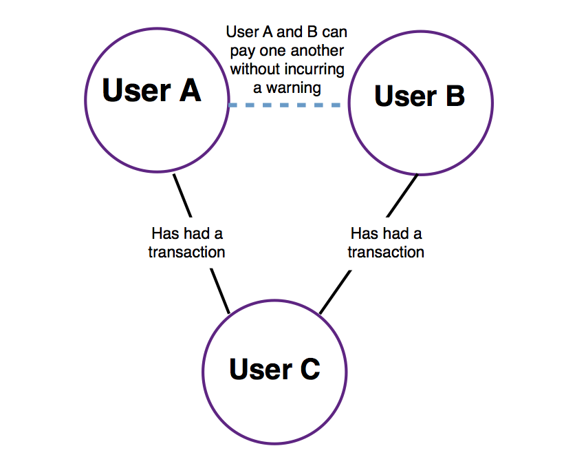
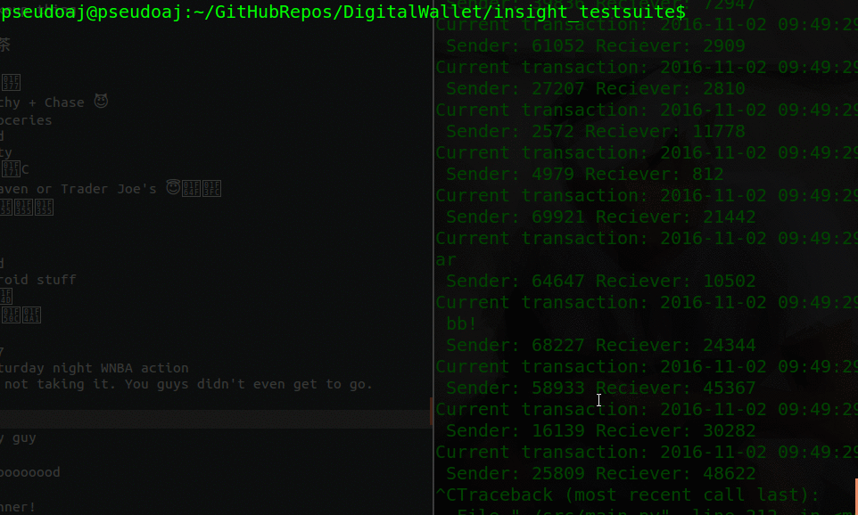

# An Efficient Data Pipeline for Fraud Detection

## Methodology
To design an efficient fraud detection feature for PayMo users; the following are the two steps of solution:

1. Building model: Using the batch_payment data to construct efficient graph data structure
1. Streaming Values: For each incoming payments searching/parsing through the model to find out the degree.

## Evaluated data structures
1. Representing the transactions graph: To represent the transaction the following data structures have been evaluated:

	1. Bloom Filters: False positive is bad
	1. Trees(AVL,RB): Maintaining N trees is costly with no real advantage.
	1. Hashmaps: O(1) access for membership queries
	1. Array: duh!

From the above mentioned data structures; Hashmaps provide us with a good performance while performing membership queries and to represent a graph, a hash map array is used for each node in graph.

For example consider the following graph:


The tree is now represented as
```
graph g =
{
	'userA':{
		'userC':'userC'
	}
	'userB':{
		'userC':'userC'
	}
	'userC':{
		'userA':'userA',
		'userB':'userB'
	}
}
```

where the graph g is a hash map array with indexes for each node and for each node as key in parent hashmap has a value of inner hashmap array containing nodes that share a edge.

## Data pipeline
```text
batch_payment        -----> Data Model
                                |
                                |
Stream at time $t_0$ -----> Fraud Detection Algorithm ----> unverified,trusted
```

Fairly, a simple pipeline that shall build the Data Model; which is a graph represented as hashmap. Once the data model is created, for each streaming value, the sender and receiver are identified and degree between them is determined to generate the warnings.

## Implementation

### Setup
Effort has been made to write as many custom implementations as possible with little use of external libraries:

1. Libraries:

	1. [Networkx](https://networkx.github.io/documentation/networkx-1.10/install.html):
	```
	pip install networkx
	```

	1. Python 2.7

1. Environment:
	1. Ubuntu 16.04
	1. git

### Algorithms
1. Generate data model:
```
For each batch_payment:
	if not sender/receiver in model:
		initialize node
	add transaction edge between sender and receiver
	update the transaction
```

1. Fraud detection algorithm:
```
For each stream_payment:
	findDegree(sender,receiver)
	update corressponding output
```

### Optimizations
Several optimizations have been made:

1. A global nodes dictionary is maintained to detect unknown transactions with O(1)
1. For the first degree neighborhood, a different scheme is used. The receiver is checked directly from the hashmap entry instead of checking entore graph. Guarantees O(edges in sender node) or bounded by O(max(Edges))

## Analysis
1. O(1) insertion into the hashmap
1. Building the grows linearly with the build transactions
1. A Breadth first search is deployed to find the degree between the sender and receiver. Which performs: O(|V|+|E|) ~ O(max(V,E)) in entire graph

## Testing


Following are the various test cases written:

1. **test-1-paymo-trans:** Basic test provided
1. **test-2-unknown-transactions:** Test case for unknown transactions to be identified by optimization rule
1. **test-3-feature2:** test for degree 2 check
1. **test-4-feature3:** extended check for degree 4

## Performance
1. Build step: This typically takes about 17.308 s. Measured as execution time and averaged over five runs.
1. Streaming: For one second of streaming data (915 transactions) are processed within 0.0649 s. Measured as execution time over five runs.

Remarks: Additionally, the build model can be cached for the user network locally.

## Conclusion
The algorithm employed is guaranteed to bound by the linear time. The data structures are scalable and no bottlenecks have been observed during initial testing.
